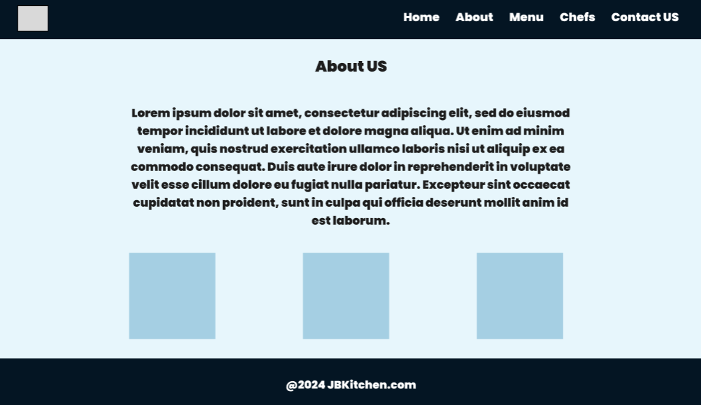
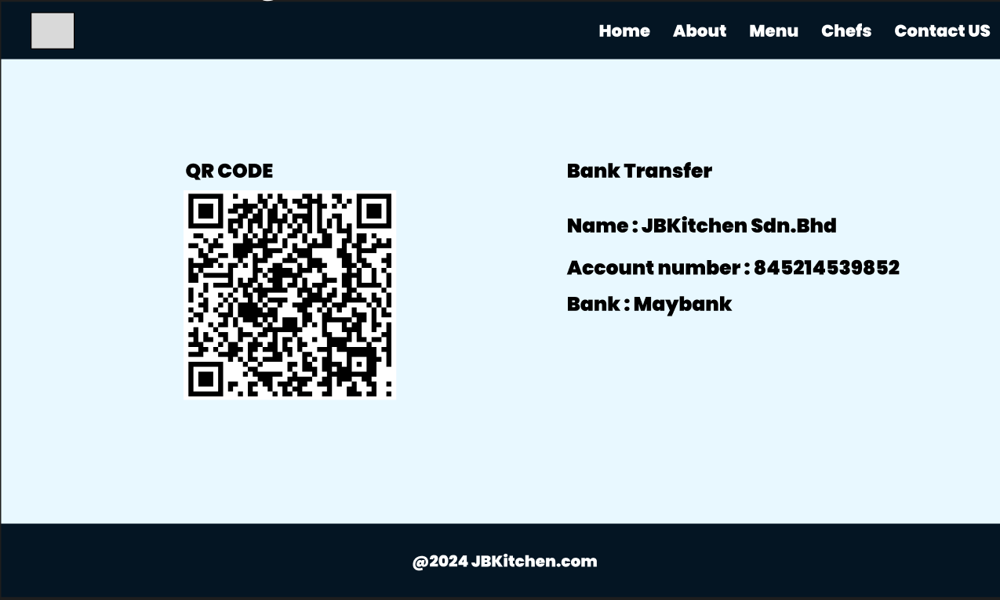
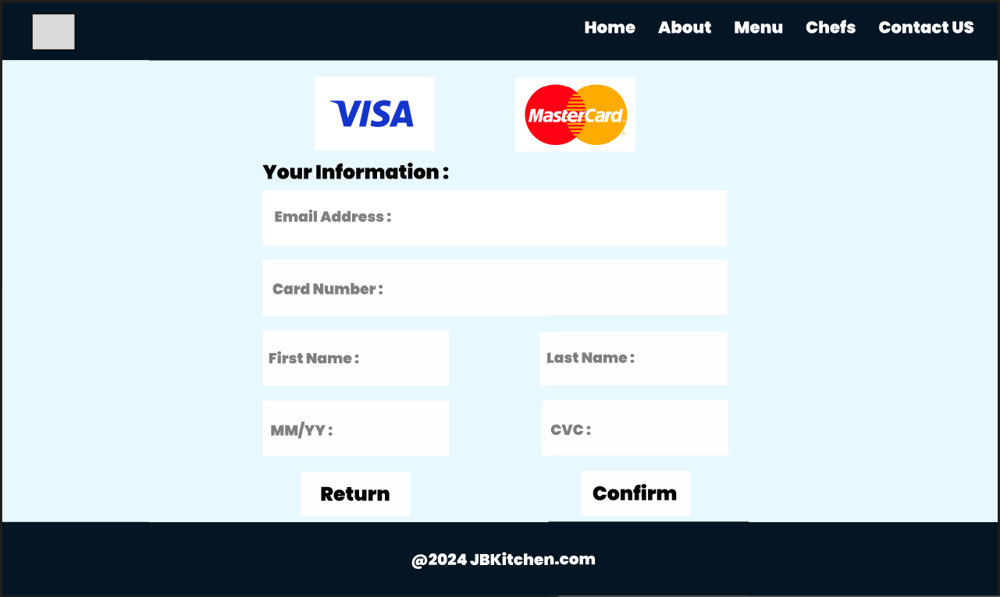
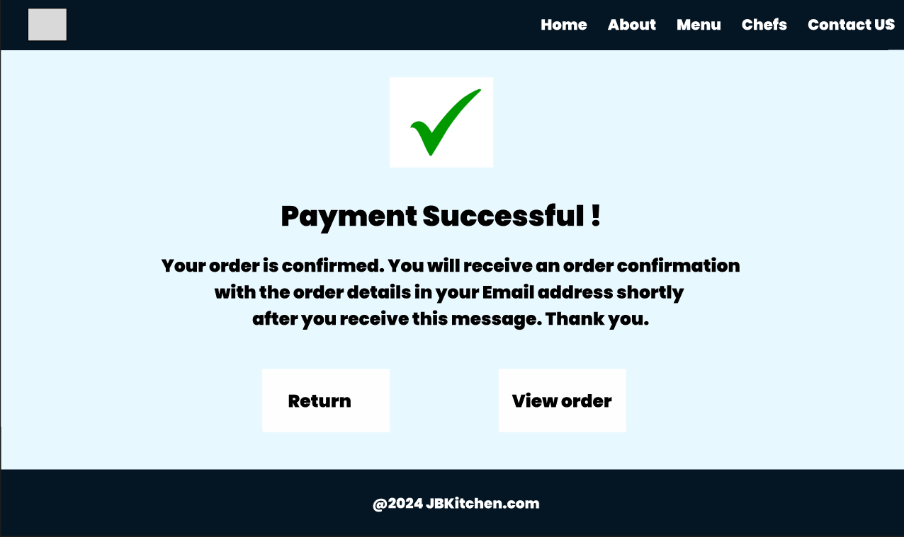

# INFO 3305 WEB APPLICATION DEVELOPMENT 

## PROJECT: PROPOSAL & MOCK UP  
## SECTION 2 (SEM 1 2023/2024)
## INSTRUCTOR: MOHD KHAIRUL AZMI BIN HASSAN 

|               NAME                    | MATRIC NO.  |
| ---------------------------------     | ----------- |
| MUHAMMAD NUR BADRI BIN MAHAZIR        | 2110797     |
| MOHAMAD AIMAN AKIM BIN ADANAN         | 2113823     |
| MOHAMAD FAWWAZ BIN ZAMRI              | 2122681     |
| MUHAMAD ARASH BIN ABDULLAH @ SHAMSUDIN| 2118279     | 
| JOHAN ADAM BIN AHMAD                  | 2116387     |

### 1.0 Project Title

Restaurant Management System
 

### 2.0 Introduction

  In the ever-evolving landscape of the culinary industry, the need for optimized and efficient restaurant management has become more urgent than ever. The project that we proposed is a restaurant management system. This system will become a great helping tool for restaurants and also users. This project aims to provide a mutually beneficial platform that meets the various requirements of customers, employees, and restaurant owners. Through the smooth integration of modern technology into the core operations of restaurants, our goals are to improve overall productivity, minimize time limitations, and raise the quality for customer satisfaction. 
 

### 3.0 Objective

  The objective of this project is to:

1. Increase the efficiency
Decrease human mistakes and errors by offering a platform for staff management, reservation handling, and other crucial activities. This increased efficiency is translated to faster service and improved order accuracy.

2. Increase the productivity
Introduce tools and features aimed explicitly at increasing staff productivity. This may include scheduling and task management functionalities. By optimizing staff workflows and providing tools for better time management, our system seeks to create an environment where staff can perform at their best.

3. Enhance customer experience
The reservation system ensures that customers can effortlessly plan their visits, reducing wait times and enhancing overall satisfaction. Through these enhancements, we aim to create a memorable and enjoyable experience for every customer, fostering loyalty and positive word-of-mouth.
 
 

### 4.0 Features and Functionalities
#### 4.1 Main Page
#### 4.1.1 Home Page

1. Display image of restaurant

2. Customers can click to go home, about, menu, chefs and contact us
 

3. Staff can click continue as staff and will navigated to log in page
 

#### 4.1.2 Login Page

1. Staff can login and will be directed to the staff page

2. Staff can click  sign up and will be directed to the sign up page.
 

#### 4.1.3 Sign Up Page

1. Staff can sign up on this page and will be directed to the staff page.
  

#### 4.2 Staff Page
#### 4.2.1 Staff duty page

1.Display a list of staff and their duty in a week.

2.The table also can be modified, by clicking on the update button it will navigate to the update duty page.
 

#### 4.2.2 Update duty page

1.Assign a duty for staff by filling the form and clicking the submit button to save.

2.Also can remove staff by clicking the delete button. 
  

#### 4.3 About page
#### 4.3.1 View about page

1.Explain more about our restaurant's background.
  

#### 4.4 Order page
#### 4.4.1 Make Order page

1.Customers can choose which meals they want.

2.Customers can use the left and right arrows to add or remove the quantity of that meal.

3.Customers just need to click the "order" button to finalize their orders.
 

#### 4.4.2 View Order page

1.Customers can see the details of orders that they make.

2.Customers can click the "back" button to go back to the previous page.

3.Customers just need to click the "pay" button once they already finalized their orders.

4.Customers also can click the "cancel" button if they want to change their mind.
  

#### 4.5 Chefs Page
#### 4.5.1 View Chefs page

1.List up the best chefs from our restaurant.
  

#### 4.6 Contact Us Page
#### 4.6.1 View Contact page

1.Customers can view the methods to contact our restaurant.

2.Customers can view the location of our restaurant.

3.Customers can click the "reserve your table" button to reserve the table and time.

#### 4.6.2 Table Reservation page

1.Customers can fill the empty boxes with the reservation details.

2.Customers just need to click the "Make a Reservation" button to submit their reservation details,  and then will be directed to the make order page.

3.Customers can click the "Cancel" button to cancel their reservation,  and then will be directed to the home page.

4. Staff can click  "Order Now" button to skip the page and will be directed to the make order page.
  

#### 4.7 Payment Page
#### 4.7.1 View Payment page

1.Customers can view the detailed payment they need to pay.

2.List up the methods that can be used by customers to make payments.

#### 4.7.2 Online Banking page

1.Customers can use either QR pay or transfer to the directed bank account to settle the payments.
 

#### 4.7.3 Credit Card page

1.Customers can view several empty boxes that they need to fill to complete the payments.
 

#### 4.7.4 Payment Successful page

1.Customers will see the payment successful.

2.Customers can click the "return" button to go back to the previous page.

3.Customers also can click the "view order" button to view back the order.
 

#### 4.7.5 Payment Failed page

1.Customers will see the payment failed.

2.Customers can click the "return" button to go back to the previous page.

3.Customers also can click the "view order" button to view back the order.
 

### 5.0 Entity Relation Diagram
  

### 6.0 Sequence Diagram

